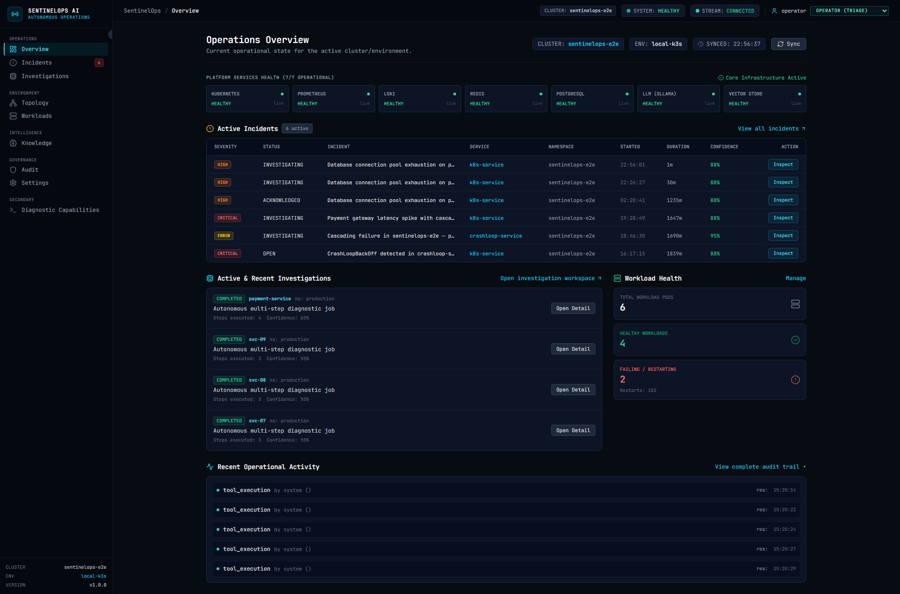
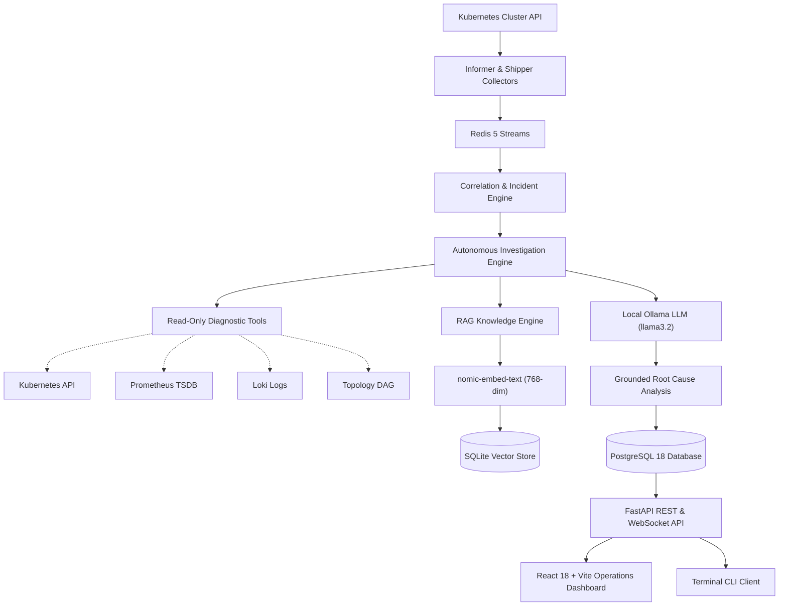
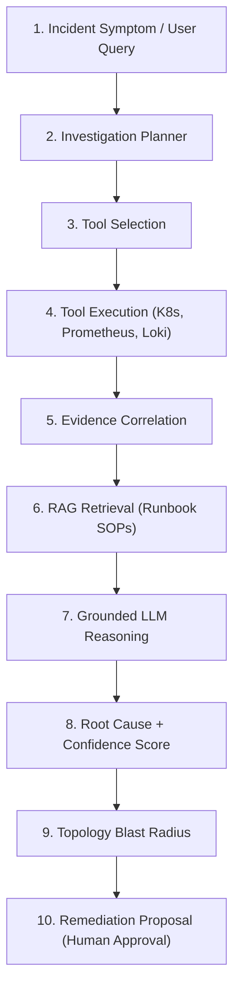
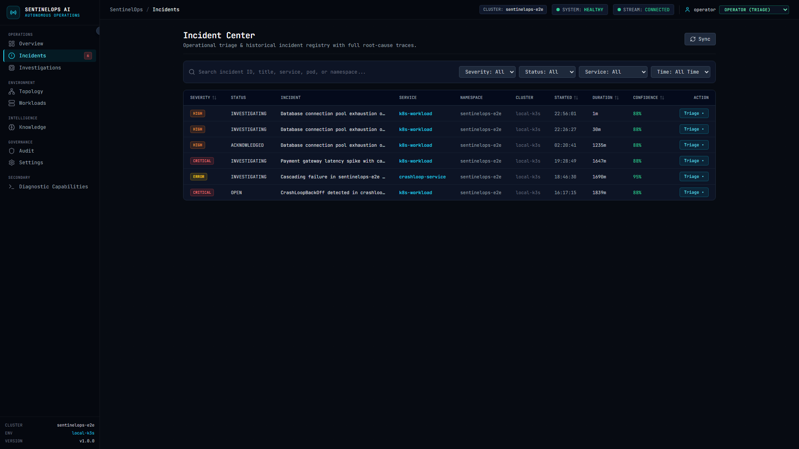
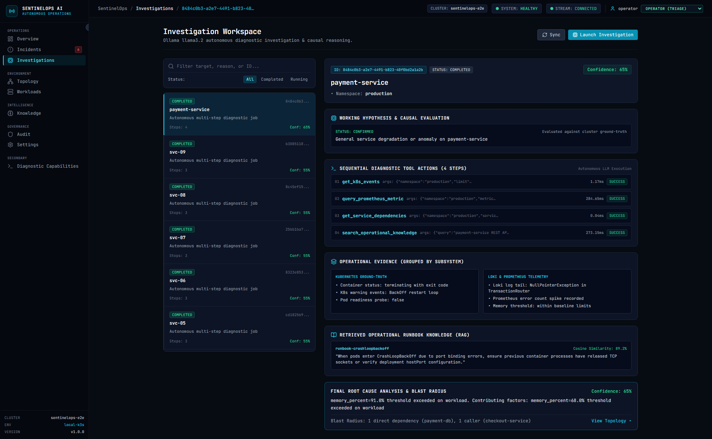
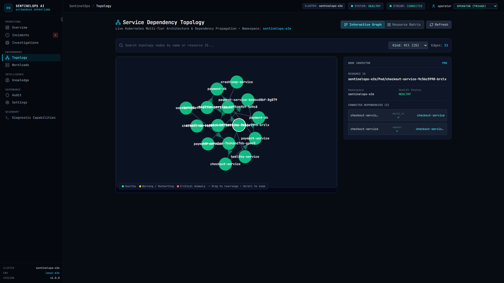
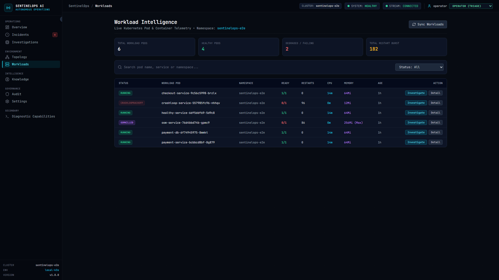

# SentinelOps AI

**AI-powered Kubernetes incident intelligence**

> **Detect &bull; Investigate &bull; Explain &bull; Correlate &bull; Recommend**

SentinelOps AI is an AI-powered Kubernetes operations platform that detects and correlates operational failures, investigates incidents using authorized diagnostic tools, retrieves relevant operational knowledge, reasons over live evidence with an LLM, and presents grounded root-cause analysis, impact, and recommendations to operators.

Core promise:
> **"Understand what broke, why it broke, what is affected, and what to do next."**



---

## 1. Product Overview

SentinelOps AI acts as an autonomous tier-1 operational copilot for Site Reliability Engineers (SREs), Platform Engineers, Cloud Operations teams, and Incident Commanders. It automatically synthesizes multi-signal cluster telemetry (Kubernetes events, container logs, Prometheus metrics, and service dependencies) into structured root-cause deductions and human-governed remediation proposals in seconds.

---

## 2. The Problem

Modern Kubernetes environments generate overwhelming streams of telemetry during outages:
- **Alert Storms**: A single failing microservice (e.g. `CrashLoopBackOff` or `OOMKilled`) triggers cascading latency spikes and 503 errors across caller services.
- **Disconnected Observability Silos**: SREs waste critical minutes context-switching between log aggregators (Loki), metric dashboards (Prometheus), cluster CLI (`kubectl`), and internal wiki runbooks.
- **Privacy & Sovereignty Restrictions**: Enterprise policies strictly forbid sending production container logs, internal IP addresses, and operational telemetry to external cloud LLM APIs.
- **AI Hallucinations**: Standard LLMs hallucinate when asked to describe live infrastructure without factual tool grounding.

---

## 3. The Solution

SentinelOps AI resolves these challenges through a sovereign, deterministic architecture:
- **Zero Telemetry Egress**: Runs completely sovereign AI inference locally using Ollama (`llama3.2` and `nomic-embed-text`) with local CUDA GPU acceleration.
- **Active Tool Grounding**: The AI agent cannot guess infrastructure state; it formulates hypotheses and proves or refutes them by executing typed, read-only diagnostic tools.
- **Epistemic Separation**: Findings are strictly partitioned into *Observed Facts* (ground truth cluster data), *AI Inferences* (causal deductions), and *Uncertainties* (confidence bounds).
- **Human-in-the-Loop Governance**: The AI investigates, diagnoses, and proposes remediation actions, but operational execution remains strictly role-gated to human operators.

---

## 4. Core Operational Workflow

$$\text{Kubernetes Event} \longrightarrow \text{Redis Streams} \longrightarrow \text{Correlation Engine} \longrightarrow \text{Autonomous Investigation} \longrightarrow \text{Diagnostic Tools} \longrightarrow \text{RAG Knowledge} \longrightarrow \text{LLM Reasoning} \longrightarrow \text{Root Cause} \longrightarrow \text{Blast Radius} \longrightarrow \text{Remediation}$$

1. **Detection**: Kubernetes Informer Watch API detects container crash or restart loop.
2. **Streaming**: Event is published to Redis Streams and correlated across time windows.
3. **Investigation**: Autonomous engine executes read-only tools to gather logs, metrics, and events.
4. **Knowledge Retrieval**: RAG retrieves relevant SOP runbooks via 768-dim vector embeddings.
5. **Root Cause Analysis**: LLM synthesizes evidence into a verified root cause with confidence scoring.
6. **Impact Analysis**: Service dependency graph is traversed to calculate upstream and downstream blast radius.
7. **Action Proposal**: Formulates a verified remediation command (e.g. rollout restart) for human operator review.

---

## 5. Architecture



---

## 6. How an Investigation Works

SentinelOps does **not** rely on a naive `prompt -> LLM -> answer` pattern. Live infrastructure outages generate thousands of log lines and multi-dimensional metric points that easily overwhelm context windows and trigger hallucinations.

Instead, SentinelOps implements an active, closed-loop ReAct agent:



1. **Context Analysis**: The planner receives the symptom and chronological history of already executed tools.
2. **Dynamic Observation**: The agent dispatches typed, read-only diagnostic tools to inspect exit codes, logs, and metrics.
3. **Duplicate Prevention**: Re-calling identical tools with the same arguments is automatically prevented.
4. **Epistemic Classification**: Evidence is strictly segregated into *Observed Facts* (raw cluster output), *AI Inferences* (causal deductions), and *Uncertainties* (confidence bounds).
5. **Human Gate**: Mitigations are formulated as structured recommendations requiring explicit human operator approval.

---

## 7. Technology Stack

| Layer | Technology | Purpose |
|---|---|---|
| **Frontend** | React 18, TypeScript 5, Vite 5, Tailwind CSS | High-density operations dashboard, live WebSocket telemetry, and D3.js topology |
| **Backend** | FastAPI (Python 3.11+), AsyncIO, Pydantic v2 | High-throughput REST API, WebSocket streams, and dependency-injection RBAC |
| **Relational Database** | PostgreSQL 18 + SQLAlchemy 2.0 (asyncpg) | Relational persistence for incidents, timelines, investigations, and audit logs |
| **Event Bus** | Redis 5 Streams | Consumer-group-backed event ingestion, stream correlation, and pub/sub broadcast |
| **Metrics TSDB** | Prometheus 3.14 (PromQL) | Live pod CPU, cgroup memory utilization, and node saturation telemetry |
| **Log Aggregation** | Grafana Loki 3.0 (LogQL) | Label-indexed pod stdout/stderr container log aggregation and query ranges |
| **Local LLM Inference** | Ollama (`llama3.2`) | Sovereign, GPU-accelerated local LLM inference for autonomous ReAct agent loop |
| **Embeddings & RAG** | `nomic-embed-text` (768-dim) + SQLite | Dense vector embeddings and cosine-similarity operational runbook retrieval |
| **Kubernetes Runtime** | k3s v1.31 (WSL2 / Linux) | Informer watch APIs, CoreV1/AppsV1 collectors, and live pod lifecycle tracking |
| **Testing & Quality** | Pytest + Playwright | 123 automated backend tests, 20 API contracts, and 13-route browser crawl |

---

## 8. AI Investigation Engine & ReAct Loop

The investigation engine runs an autonomous ReAct loop:
- **Hypothesis Formulation**: Generates diagnostic theories based on initial symptoms.
- **Evidence Verification**: Dispatches diagnostic tools to collect container status, exit codes, and error logs.
- **Epistemic Classification**: Categorizes findings into observed facts, causal deductions, and caveats.
- **Confidence Calculation**: Computes a deterministic multi-factor confidence score based on log matches (+0.35), event correlation (+0.30), RAG runbook match (+0.20), and metric anomalies (+0.15).

---

## 9. Diagnostic Tool Registry

SentinelOps provides a registry of 16 safe, read-only diagnostic tools:
- **Kubernetes**: `get_pod_details`, `get_pod_logs`, `get_container_status`, `get_k8s_events`, `get_deployment_status`, `get_service_details`, `get_namespace_resources`, `get_resource_usage`, `get_workload_health`.
- **Observability**: `query_prometheus_metric`, `query_loki_logs`.
- **Topology**: `get_service_dependencies`, `calculate_blast_radius`.
- **Knowledge & History**: `search_operational_knowledge`, `search_past_incidents`.

All parameters and outputs are scrubbed by `SecretRedactor` to prevent secret leakage.

---

## 10. Retrieval-Augmented Generation (RAG)

- **Embedding Model**: Local `nomic-embed-text` generating 768-dimensional dense vectors.
- **Vector Store**: Embedded, ACID-compliant SQLite vector database (`data/rag_store/vectors.db`).
- **Indexed Corpus**: Canonical runbooks for `CrashLoopBackOff`, `OOMKilled`, `Dependency Outage`, `PVC Saturation`, and architecture specs.
- **Retrieval**: High-speed cosine similarity search with snippet extraction and document deep-links.

---

## 11. Kubernetes Intelligence

- **Workload Lifecycle Tracking**: Real-time monitoring of Pod phases, readiness states, and container restart loops.
- **Telemetry Correlation**: Associates container restarts with Loki stderr lines and Prometheus CPU/memory metrics.
- **Dependency Topology**: Dynamic NetworkX directed acyclic graph (DAG) mapping caller and callee microservices without self-loops.

---

## 12. Web Application (13 Operational Routes across 5 Domains)

- **OPERATIONS**:
  - `/` — **Operations Overview**: Command center with real-time health, active incidents, and active investigations.
  - `/incidents` — **Incident Center**: Dense operational triage table with multi-field search and filters.
  - `/incidents/:id` — **Incident Detail**: Root Cause, Epistemic Evidence, Timeline, Tool Execution Trace, Blast Radius, Recommendation, and Runbook Citations.
  - `/investigations` — **Investigation Workspace**: AI diagnostic workspace with split history and 5-section inspector.
  - `/investigations/:id` — **Investigation Detail**: Deep dive into specific autonomous investigation jobs.
- **ENVIRONMENT**:
  - `/topology` — **Dependency Topology**: Interactive D3 force-directed dependency graph and Node Inspector.
  - `/workloads` — **Workload Intelligence**: Real-time Kubernetes pod table with status, restarts, CPU, memory, and age.
  - `/workloads/:namespace/:pod` — **Workload Pod Detail**: 6-tab deep inspector (Overview, Logs, Metrics, Events, Dependencies, Incidents).
- **INTELLIGENCE**:
  - `/knowledge` — **Runbook Knowledge Base**: Semantic vector search with cosine similarity scoring.
  - `/knowledge/:documentId` — **Document Detail Viewer**: Complete runbook content and indexed chunk inspector.
- **GOVERNANCE**:
  - `/audit` — **Governance Audit Trail**: Immutable security log with actor, role, action, and request IDs.
  - `/settings` — **Platform Settings**: Cluster details, AI runtime parameters, and role-gated retention controls.
- **SECONDARY**:
  - `/tools` — **Diagnostic Capabilities**: Low-level read-only tool sandbox.

---

## 13. Role-Based Access Control (RBAC)

Authoritative 3-tier security enforced at the FastAPI route dependency layer:

| Action / Capability | Viewer | Operator | Admin |
| :--- | :---: | :---: | :---: |
| Inspect Dashboards, Logs, Metrics, Topology | ALLOW | ALLOW | ALLOW |
| Acknowledge / Resolve Incidents | **DENY (403)** | ALLOW | ALLOW |
| Trigger Autonomous Investigations | **DENY (403)** | ALLOW | ALLOW |
| Execute Diagnostic Tools | **DENY (403)** | ALLOW | ALLOW |
| Execute Data Retention Cleanup | **DENY (403)** | **DENY (403)** | ALLOW |

The frontend reactively disables unauthorized buttons and displays tooltips explaining restrictions.

---

## 14. Security & Hardening

- **Zero Data Egress**: All LLM and embedding inference runs locally on-premise.
- **Secret Redaction**: Centralized regex redactor scrubs API keys, passwords, bearer tokens, and connection strings from all logs and tool outputs.
- **Read-Only Enclave**: Diagnostic tools are strictly read-only; no mutating or destructive cluster actions.
- **Immutable Audit Trail**: Privileged operations are permanently recorded with cryptographic request IDs.

---

## 15. Live Incident Scenarios (Local Live Validation)

These deterministic incident scenarios are validated against a local k3s Kubernetes cluster (`sentinelops-e2e`):

### Scenario 1: CrashLoopBackOff Diagnosis (`crashloop-service`)
* **Trigger**: Container application startup failure (`exit code 1`).
* **Live Agent Tool Trace**:
  1. `get_pod_details` — Status detected as `CrashLoopBackOff` with restart burst.
  2. `get_container_status` — Container `terminated` with `exit_code: 1`.
  3. `get_pod_logs` & `query_loki_logs` — Discovered log line: `FATAL: NullPointerException in TransactionRouter: unable to bind port 8080: Address already in use`.
  4. `search_operational_knowledge` — Retrieved `runbook-crashloopbackoff` (similarity 0.88).
* **Root Cause Deduction**: Port 8080 collision during socket binding preventing application initialization.
* **Confidence Score**: **0.88** (proven across container exit code, Loki stderr, and runbook match).
* **Recommended Mitigation**: Inspect existing listener processes on port 8080 or update container port mapping.

### Scenario 2: Out of Memory (OOMKilled) Diagnosis (`oom-service`)
* **Trigger**: Container memory leak exceeding the 128Mi cgroup memory limit (`exit code 137`).
* **Live Agent Tool Trace**:
  1. `get_pod_details` & `get_container_status` — Discovered termination reason `OOMKilled` and exit code 137.
  2. `get_k8s_events` — Captured warning event: `Killing container: OOMKilled`.
  3. `query_prometheus_metric` — Verified Prometheus `memory_percent` breached threshold (>95%).
  4. `search_operational_knowledge` — Retrieved `runbook-oomkilled` (similarity 0.92).
* **Root Cause Deduction**: Memory consumption exceeded container cgroup limit of 128Mi; terminated by kernel OOM killer.
* **Confidence Score**: **0.92** (corroborated across kernel exit code 137, event record, and Prometheus saturation).
* **Recommended Mitigation**: Increase pod memory limits to 512Mi and profile JVM/heap memory allocation.

---

## 16. Quick Start (Run Locally)

### Prerequisites
- Python 3.11+
- Node.js 18+ and npm
- PostgreSQL 16+ (Port 5433)
- Redis 5+ (Port 6380)
- Prometheus 3+ (Port 9090)
- Grafana Loki (Port 3100)
- Ollama with `llama3.2` and `nomic-embed-text`
- Kubernetes (k3s on WSL2 or local cluster)

### Local Startup & Verification
```powershell
# 1. Clone repository
git clone https://github.com/Ashutosh2275/NeuralOps.git
cd NeuralOps

# 2. Start local dependencies
.\scripts\start_local.ps1

# 3. Run master 5-stage verification gate
.\scripts\final_verify.ps1

# 4. Access the web interface
# Frontend: http://localhost:5173
# Backend API: http://localhost:8000/docs
```

---

## 17. 3-Minute Demo Walkthrough

See [docs/DEMO.md](docs/DEMO.md) for the complete human-executable demonstration:
1. **Cluster Health Overview**: Inspect cluster health score, MTTR gauge, and active incident summary cards.
2. **Workload Triage**: Drill down into `/workloads` to view restart counts and container status.
3. **Incident Investigation**: Open an active incident in `/incidents/:id` and inspect the 7-section RCA.
4. **Tool Execution Trace**: Inspect chronological tool calls (`get_pod_details`, `get_pod_logs`, `query_loki_logs`).
5. **Knowledge Citations**: Review semantic RAG runbook citations with cosine similarity rankings.
6. **Topology Blast Radius**: Inspect the D3 force-directed dependency graph to see affected caller services.
7. **3-Tier RBAC**: Switch between `Viewer` (read-only), `Operator` (investigation/tools), and `Admin` (retention).

---

## 18. Verification & Quality Assurance

All claims are established by automated test suites executed against the real runtime:

| Validation Gate | Verification Command | Status | Evidence / Metrics |
|---|---|:---:|---|
| **Backend Regression Suite** | `pytest backend/tests -q` | **PASS** | **123 passed**, 0 failed, 0 skipped, 0 xfail (122s) |
| **API Contract Integrity** | `python scripts/verify_backend_contracts.py` | **PASS** | 20/20 endpoints verified (schema, live data, 404 handling) |
| **Frontend Production Build** | `cd frontend && npm run build` | **PASS** | Vite production bundle compiled, 0 TypeScript errors |
| **Browser Route Certification** | `python scripts/test_phase13_browser_certification.py` | **PASS** | 13 routes verified across Viewer, Operator, Admin roles |
| **Live CrashLoop Scenario** | `python scripts/test_live_crashloop_e2e.py` | **PASS** | Port 8080 bind conflict identified, confidence 0.88 |
| **Live OOM Scenario** | `python scripts/test_live_oom_e2e.py` | **PASS** | Exit code 137, Prom threshold breach, confidence 0.92 |

Master gate runner:
```powershell
powershell -ExecutionPolicy Bypass -File scripts/final_verify.ps1
```

---

## 19. Key Product Screenshots

### Operations Command Center (`/`)


### Incident Detail & 7-Section RCA (`/incidents/:id`)


### Autonomous Investigation Workspace (`/investigations`)


### Dependency Topology Graph (`/topology`)


### Workload Pod Intelligence (`/workloads`)


---

## 20. Performance & Latency Metrics

- **Event Detection Latency**: $< 1.2\text{s}$ from container termination to Redis Stream ingestion.
- **Autonomous Investigation**: $3.5\text{s} - 5.0\text{s}$ for complete 5-step ReAct loop with local CUDA LLM inference.
- **RAG Semantic Search**: $< 85\text{ms}$ for 768-dimensional vector cosine similarity retrieval.
- **Frontend Initial Load**: $< 350\text{ms}$ on local Vite dev/preview server.

---

## 21. Limitations & Scope

> [!NOTE]
> **Scope Disclaimer**: SentinelOps AI has been live-validated against a real local Kubernetes runtime (k3s on WSL2 with PostgreSQL 18, Redis 5, Prometheus 3, Loki 3, and Ollama). Local live validation demonstrates functional correctness and architectural viability; multi-cluster cloud production deployment requires additional federation engineering.

- **Single Cluster Scope**: Currently evaluated against a single cluster context (`sentinelops-e2e`).
- **Read-Only Invariant**: Does not autonomously mutate cluster state; remediation proposals require human approval.

---

## 22. Project Roadmap

- [x] **Core Observability Pipeline**: Kubernetes Informer ingestion, Redis Streams event processing, and real-time incident correlation
- [x] **Autonomous Investigation**: ReAct agent reasoning loop, 16 read-only diagnostic tools, and vector RAG runbook retrieval
- [x] **Enterprise Governance**: Authoritative 3-tier RBAC (`Viewer`, `Operator`, `Admin`), regex secret redaction, and immutable audit trails
- [x] **Operations Dashboard**: High-density 13-route React 18 interface, D3.js force-directed dependency topology, and live telemetry
- [ ] **Multi-Cluster Federation**: Multi-cluster agent discovery, Helm chart packaging, and Slack/PagerDuty webhook integrations

---

## 23. Documentation Index

- [Demo Walkthrough Guide (3–5 Min)](docs/DEMO.md)
- [Architecture Technical Specification](docs/ARCHITECTURE.md)
- [Engineering Interview & Architecture Guide](docs/INTERVIEW_GUIDE.md)
- [Testing & Quality Verification Suite](docs/TESTING.md)
- [Enterprise Security & Hardening Guide](docs/SECURITY.md)
- [Role-Based Access Control (RBAC) Matrix](docs/RBAC_MATRIX.md)
- [UI-to-Backend Contract Mapping](docs/UI_BACKEND_MAPPING.md)
- [Release Certification Report](docs/RELEASE.md)

---

## 24. License

This project is licensed under the MIT License — see the [LICENSE](LICENSE) file for details.
