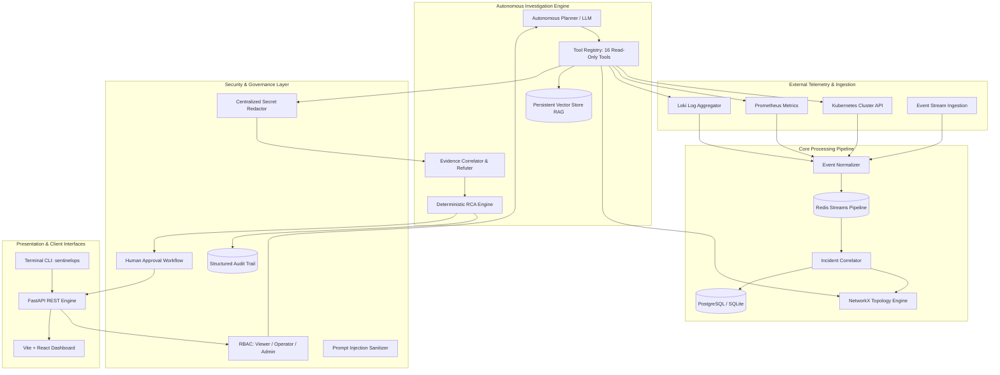

# SentinelOps AI — Complete Platform Architecture

## 1. System Overview
SentinelOps AI is an enterprise-scale, event-driven AI operational intelligence platform for Kubernetes environments. It unifies real-time event streaming, dynamic topology intelligence, persistent vector retrieval (RAG), autonomous read-only tool calling, and human-in-the-loop governance into a deterministic operational engine.

---

## 2. High-Level Architecture Diagram

---

## 3. Core Component Subsystems

### 3.1 Autonomous Tool Calling Framework
- 16 registered operational tools spanning Kubernetes inspection, Prometheus metrics, Loki logs, topology impact, past incidents, and RAG knowledge.
- In Phase 4, **all tools remain strictly `READ_ONLY`**. Mutating write actions are prohibited.

### 3.2 Evidence Correlation & Deterministic RCA
- Correlates multi-source telemetry items into cohesive investigation evidence.
- Epistemic refutation: Healthy live states (`Running`, `ready=True`, `restarts=0`) actively refute stale alert triggers.
- Grounded citations link every root-cause claim directly to specific evidence items.

### 3.3 Security & Governance Architecture
- Deterministic RBAC with VIEWER, OPERATOR, and ADMIN roles.
- Human approval governance for operational actions with strict Phase 4 execution blocking.
- Centralized secret redactor sanitizing AWS keys, JWTs, Bearer tokens, DB credentials, and private keys.
- Durable, append-oriented audit logging with automated data retention policies.

### 3.4 Evaluation & Benchmarking Suite
- 20 golden operational scenarios covering standard and adversarial failure modes.
- Epistemic classification into `FACT`, `INFERENCE`, and `UNCERTAINTY`.
- 10,000+ synthetic logical asset scale validation with sub-millisecond graph traversals.
