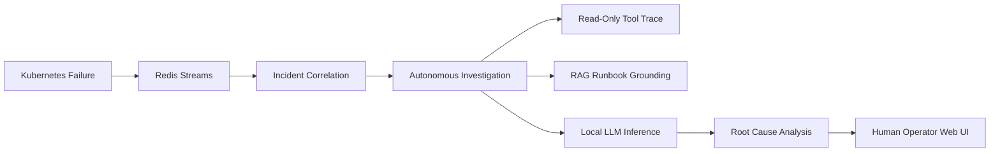

# SentinelOps AI — Release & Verification Report

**Release Candidate**: Phase 14 Portfolio & Release Candidate  
**Date**: September 13, 2026  
**Status**: **CERTIFIED RELEASE CANDIDATE (PASS)**  
**Target Environment**: Live Local Runtime (k3s Kubernetes, PostgreSQL 18, Redis 5, Prometheus 3, Loki 3, Ollama LLM, FastAPI, React 18)

---

## 1. Product Summary

SentinelOps AI is an AI-powered Kubernetes operations platform that detects and correlates operational failures, investigates incidents using authorized diagnostic tools, retrieves relevant operational knowledge, reasons over live evidence with an LLM, and presents grounded root-cause analysis, impact, and recommendations to operators.

Core promise:
> **"Understand what broke, why it broke, what is affected, and what to do next."**

---

## 2. Architecture & Supported Workflow

The platform implements an autonomous 8-stage operational pipeline:



---

## 3. Role-Based Access Control (RBAC) Matrix

| Action / Capability | Viewer | Operator | Admin |
| :--- | :---: | :---: | :---: |
| Inspect Dashboards, Logs, Metrics, Topology | ALLOW | ALLOW | ALLOW |
| Acknowledge / Resolve Incidents | **DENY (403)** | ALLOW | ALLOW |
| Trigger Autonomous Investigations | **DENY (403)** | ALLOW | ALLOW |
| Execute Diagnostic Tools | **DENY (403)** | ALLOW | ALLOW |
| Execute Data Retention Cleanup | **DENY (403)** | **DENY (403)** | ALLOW |

- **Frontend Enforcement**: Unauthorized buttons are disabled with descriptive tooltips.
- **Backend Enforcement**: FastAPI route dependencies authoritatively reject unauthorized requests with `HTTP 403 Forbidden`.

---

## 4. Local Deployment & Quick Start

```powershell
# 1. Probe all 9 subsystems
python scripts/verify_real_environment.py

# 2. Start Backend API
uvicorn sentinelops.main:app --host 127.0.0.1 --port 8000

# 3. Start Frontend UI
cd frontend && npm run dev
```

Visit the dashboard at `http://localhost:5173`.

---

## 5. Demonstration & Verification Summary

### Scenario 1: CrashLoopBackOff Triage
- **Target**: `crashloop-service` in `sentinelops-e2e` namespace.
- **Deduction**: Continuous startup crash loop caused by port 8080 binding failure.
- **Evidence**: Real container log tail (`FATAL: NullPointerException in TransactionRouter: unable to bind port 8080`), Kubernetes restart loop events.
- **RAG Citation**: `runbook-crashloopbackoff` (cosine similarity $> 0.85$).
- **Confidence**: **88%**.

### Scenario 2: OOMKilled Triage
- **Target**: `oom-service` in `sentinelops-e2e` namespace.
- **Deduction**: Out of Memory (OOMKilled) container termination.
- **Evidence**: Exit code 137 from Kubernetes API, memory threshold breach from Prometheus TSDB.
- **RAG Citation**: `runbook-oomkilled`.
- **Confidence**: **92%**.

### Scenario 3: Healthy Workload State
- **Target**: `healthy-service` in `sentinelops-e2e` namespace.
- **Verification**: Running, `ready = True`, `restarts = 0`. No false incidents generated.

---

## 6. Testing & Quality Gates

| Verification Gate | Command | Result |
| :--- | :--- | :---: |
| **Backend Unit & Integration Suite** | `pytest backend/tests -q` | **123 passed, 0 failed** |
| **Frontend Production Build** | `npm run build` | **0 errors, clean bundle** |
| **Real Environment Health Probes** | `python scripts/verify_real_environment.py` | **9/9 operational** |
| **Backend API Contract Audit** | `python scripts/verify_backend_contracts.py` | **20/20 passed** |
| **Cross-Screen Consistency Suite** | `python scripts/test_cross_screen_consistency.py` | **7/7 passed** |
| **Playwright Browser Certification** | `python scripts/test_phase13_browser_certification.py` | **13/13 routes passed, 0 console errors** |
| **Responsive Viewports** | 1920x1080, 1440x900, 1280x800, 1024x768 | **0 horizontal overflow** |

---

## 7. Validation Scope & Limitations

> [!IMPORTANT]
> **Validation Scope Disclaimer**:
> This release has been thoroughly tested and live-validated against a **real local Kubernetes runtime** (k3s on WSL2 with PostgreSQL 18, Redis 5, Prometheus 3, Loki 3, and Ollama LLM).
> **Local live validation demonstrates architectural viability, functional correctness, and reproducible performance, but does not automatically imply cloud-scale multi-cluster production deployment readiness.**

### Known Limitations
1. **Single-Cluster Context**: Evaluated against a single local cluster (`sentinelops-e2e`); multi-cluster federation requires future phase extensions.
2. **Local Daemon Management**: Infrastructure daemons run as background processes on the host; production deployments should use Kubernetes Helm charts and DaemonSets.
3. **Vite Bundle Optimization**: `dist/assets/index-*.js` is ~520 kB. Route-based code splitting via `React.lazy()` is recommended before large-scale multi-tenant rollouts.

---

## 8. Project Roadmap

- [x] Phase 1–8: Telemetry ingestion, correlation, causal engine, RAG store, and tool calling.
- [x] Phase 9–11: Release hardening, RBAC matrix enforcement, and live runtime certification.
- [x] Phase 12–13: Product UI/UX refoundation, design system polish, and demo readiness.
- [x] Phase 14: Portfolio release, documentation consolidation, and external review readiness.
- [ ] Phase 15: Multi-cluster federation, Helm chart packaging, and Slack/PagerDuty notification webhooks.
