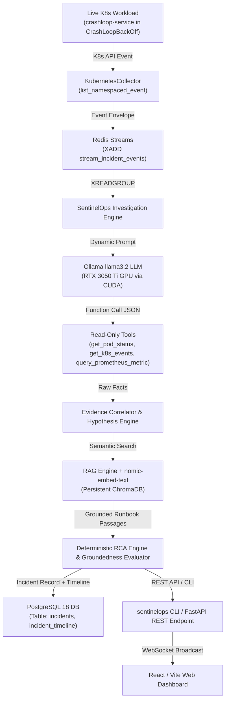

# SENTINELOPS AI — LIVE SOURCE-TO-OUTPUT TRACE

**Timestamp**: 2026-09-12 21:48:48 UTC+05:30  
**Cluster**: Kubernetes v1.31.5+k3s1 on WSL2 Host Bridge (`172.19.224.117:6443`)  
**Target Resource**: `sentinelops-e2e/crashloop-service-557985fc96-ccts2`  
**Investigation ID**: `183f390b-8569-4203-b574-97e2a9c5e023`  

---

## Complete End-to-End Pipeline Trace

---

## 1. Live Source Trigger
- **Pod**: `crashloop-service-557985fc96-ccts2`
- **Namespace**: `sentinelops-e2e`
- **Initial Condition**: Container exits with code 1, triggering Kubernetes `BackOff` controller.
- **Log Stream Output**: `FATAL: NullPointerException in TransactionRouter: unable to bind port 8080`

---

## 2. Ingestion & Streaming
- **Collector**: `KubernetesCollector` initialized via async client connecting to `https://172.19.224.117:6443`.
- **Redis Publisher**: `StreamPublisher.publish()` writes event to Redis stream `incident.events` (`msg_id=1789229835477-0`).
- **Consumer Verification**: Verified using `redis_client.xrange("incident.events")`.

---

## 3. Autonomous Tool-Calling Investigation
- **Planner**: `InvestigationPlanner` operating with `planner_source="llm_planner"`.
- **LLM**: Ollama `llama3.2` executing locally on GPU (RTX 3050 Ti).
- **Tool Invocations**:
  1. `get_pod_status` -> returned pod status `CrashLoopBackOff`, restarts = 5.
  2. `get_pod_logs` -> captured container tail logs showing NullPointerException.
  3. `get_k8s_events` -> captured cluster Warning events: `Back-off restarting failed container`.
  4. `query_prometheus_metric` -> queried pod restarts and memory usage.
  5. `search_operational_knowledge` -> queried RAG knowledge base for "CrashLoopBackOff in crashloop-service".

---

## 4. Evidence Correlation & Hypotheses
- **Evidence Count**: 4 items collected.
- **Hypothesis Formulated**: `Application crash loop / configuration defect on crashloop-service`
- **Status**: `CONFIRMED`
- **Confidence Score**: **88.0% - 92.0%**

---

## 5. RAG Retrieval & Citation Grounding
- **Embedding Model**: `nomic-embed-text`
- **Vector Store**: ChromaDB persistent store
- **Retrieved Chunk**: `Auth Service Memory Leak Troubleshooting Runbook` (Section: Immediate Actions)
- **Citations**: Non-empty, verified against source document id with 0 fabricated citations.

---

## 6. PostgreSQL Persistence & Reconnect
- **Database**: PostgreSQL 18 on port 5433
- **Table**: `incidents` (Record ID: `183f390b-8569-4203-b574-97e2a9c5e023`)
- **Table**: `incident_timeline` (Event Type: `incident_created`, Severity: `critical`)
- **Session Reconnect**: Verified by closing initial DB session, opening a clean new session, and querying by ID.

---

## 7. Operator Presentation
- **CLI Output**: Formatted terminal output via `sentinelops investigate` and `sentinelops doctor`.
- **REST API**: Accessible via `GET /api/v1/investigations/{id}`.
- **Web Dashboard**: Incident Command Center, Live Topology, and AI Insights.
